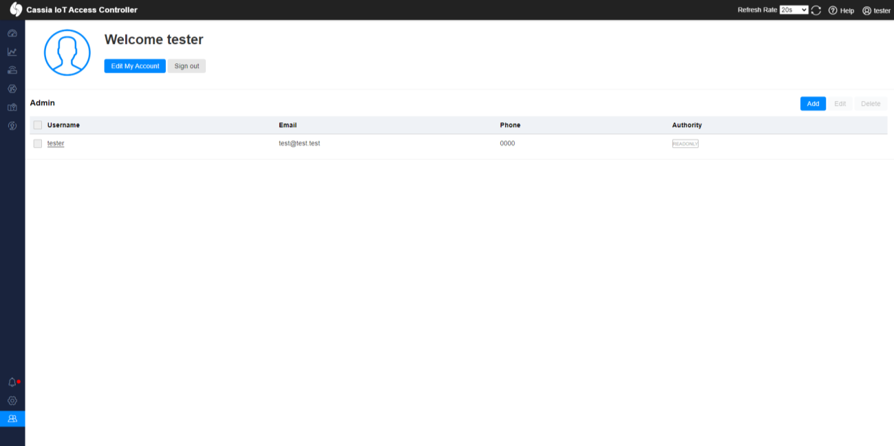
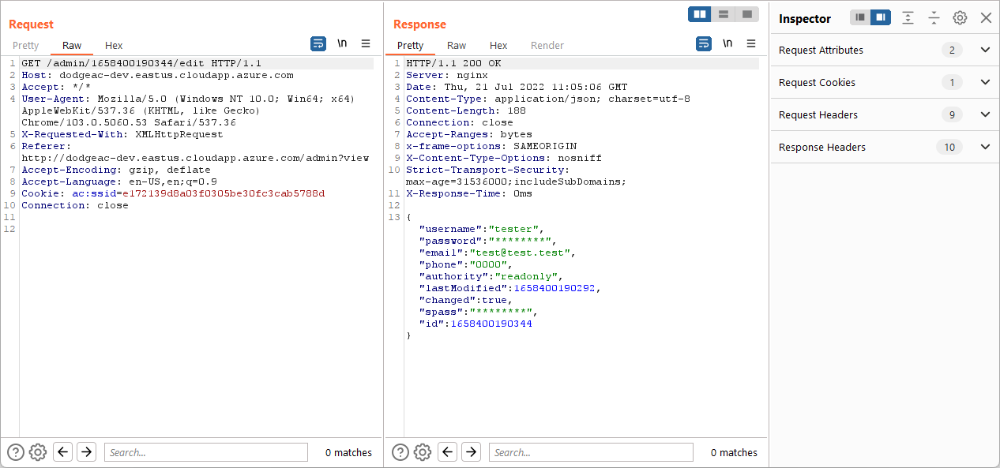
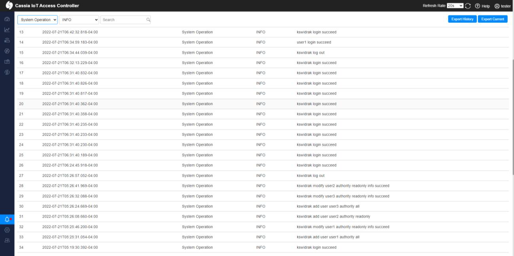
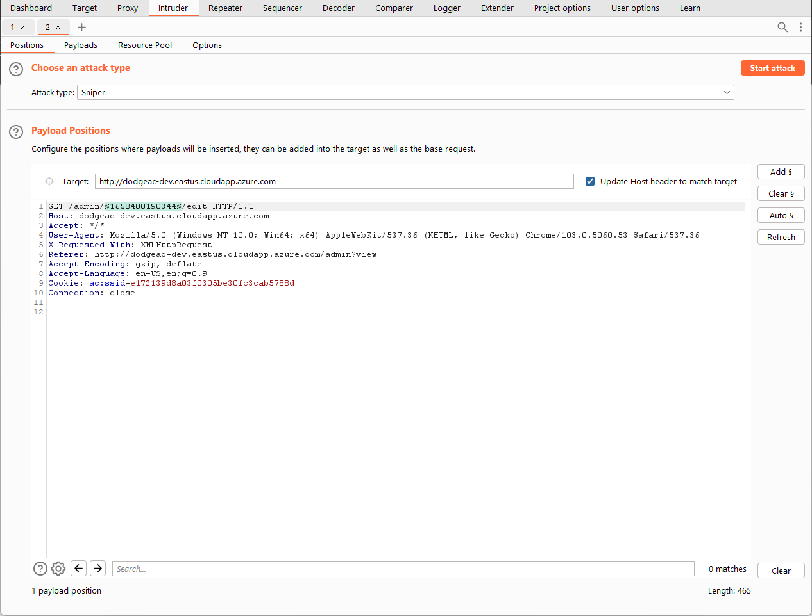
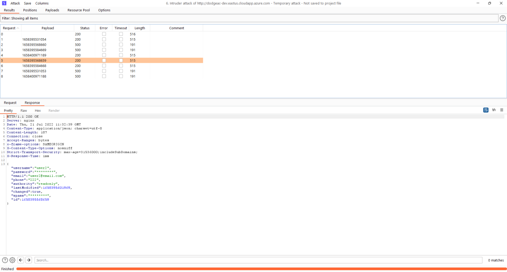
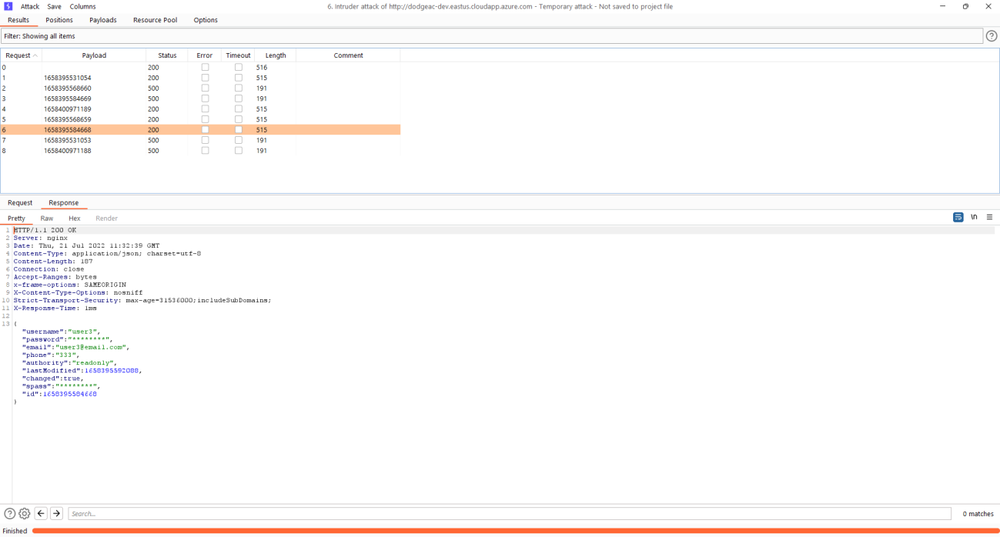

# CVE-2023-31445-Unprivileged-Information-Disclosure
Repository contains description for CVE-2023-31445 discovered by Dodge Industrial
Team for Dodge OPTIFY platfrom.
___  
CVE ID: CVE-2023-31445
Vendor: Cassia Networks  
Product: Access Controller  
Version: Cassia-AC-2.1.1.2203171453  
___
Vulnerability: Unprivileged Information Disclosure  
Affected: logs, users data  
Decription: Read-only users have ability to enumerate all other users and disclose information as e-mail addresses, phone numbers and privileges of all other users. This may lead to further steps as targeted e-mail campaigns and social engineering attacks.  
Status: Confirmed by vendor, Fixed  
Version Patched: Cassia-AC-2.1.1.2207292123
____
#### Details
Administrator account has privileges to see data of all of the users registered in Access Controller as example:

Read-Only user can only view himself:

Edit Account invokes /admin/(userId)/edit, wher Id is the UserId:

There is no validation between permissions and actual userId that Read-Only user uses in the request.  
It allows Read-Only user to enumerate all other users without administrative access.  This is considered as Unprivileged Information Disclosure.  
It can be achieved by bruteforcing.  
More of that, Id can be easily guessed as it is UNIX time format of exact user creation
date - what can be obtain from the logs which are all also visible for Read-Only user.  
____
#### Exploitation
Every of the activity is done from tester (Read-Only user) context.
1) Gather information about account creation from logs
  
  
2) Convert data to UNIX format
  

Table from PoC

| Username | Time Log | Time UNIX | Permissions |
| ------------- | ------------- | ------------- | ------------- |
| User1 | 2022-07-21T05:25:31.054-04:00 | 1658395531054 | Readonly |
| User2 | 2022-07-21T05:26:08.660-04:00 | 1658395568660 | Readonly |
| User3 | 2022-07-21T05:26:24.669-04:00 | 1658395584669 | Readonly |
| Testadmin | 2022-07-21T06:56:11.189-04:00 | 1658400971189 | Administrator |

Note! There might be little variation between UNIX timestamp and assigned Id (+-1)  
it depends on the speed of the server and current occupation of processing resources.

3) Enumerate API endpoint  
Burp was used in this PoC  

4) Run enumeration and gather outcomes

#### Remediation
- Patch to the highest possible version availaible on [Cassia Networks](https://www.cassianetworks.com/)